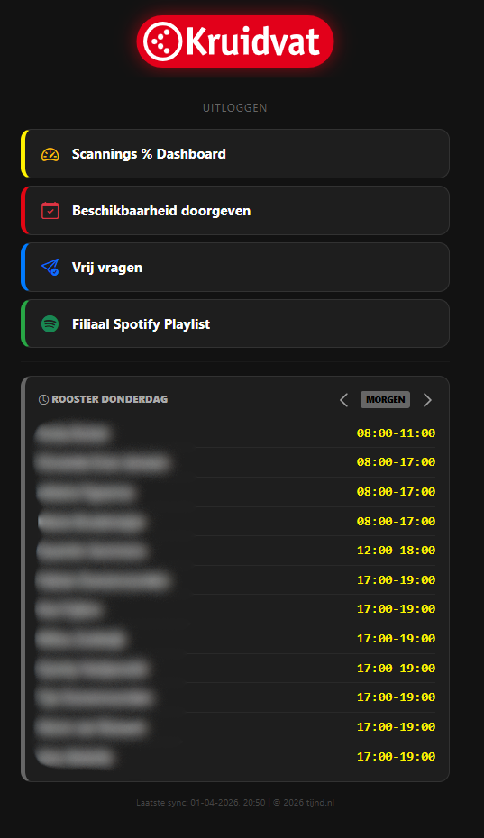
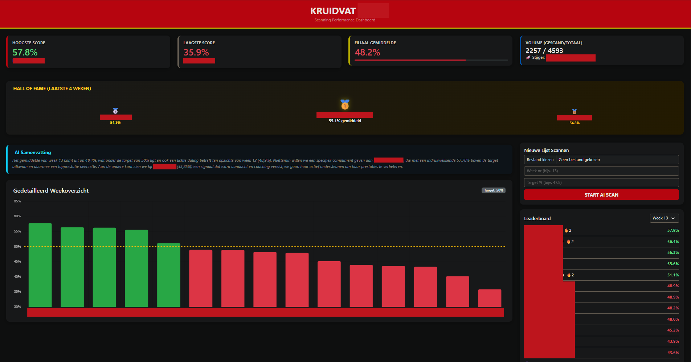

# 🚀 Retail Team Portal (Filiaal 7443)

Een interactief, real-time dashboard ontwikkeld om de interne communicatie en efficiëntie op de werkvloer te verbeteren. Dit project is specifiek gebouwd voor een Kruidvat-filiaal om data uit hun systemen te vertalen naar een gebruiksvriendelijke interface voor het hele team.

## 🌟 Belangrijkste Features
- **Interactief Weekrooster:** Navigeer eenvoudig door de week met een dynamische PHP-backend.
- **Slimme Automatisering:** Een Node.js file haalt dagelijks automatisch de nieuwste roosters op.
- **Centraal Hub:** Directe toegang tot scannings-dashboards, beschikbaarheidsformulieren en de filiaal-playlist.
- **Security First:** Toegang beveiligd met een pincode en sessiebeheer.
- **Mobile Responsive:** Volledig geoptimaliseerd voor gebruik via smartphone.

## 🛠️ Tech Stack
- **Backend:** PHP (Sessiebeheer, Dynamische routing)
- **Automatisering:** Node.js & Puppeteer (Web Scraping / Data Integration)
- **Frontend:** HTML5, CSS3 (Bootstrap 5, Custom Dark Mode UI)
- **Data:** JSON-gebaseerde opslag voor snelle laadtijden
- **Server:** Gehost op een Proxmox LXC container (Ubuntu/Nginx) met Cronjob automatisering.

## 📈 Impact
Dit dashboard overbrugt de kloof tussen verschillende generaties op de werkvloer (16 tot 60+ jaar). Het zorgt ervoor dat iedereen toegang heeft tot handige overzichten, wat resulteert in:
- Hogere medewerkersbetrokkenheid.
- Real-time inzicht in filiaalprestaties (scannings-targets).
- Snellere communicatie rondom planning en beschikbaarheid.

## 📸 Preview

---
*Ontwikkeld door Tijn - 2026*
